# Marksheet Management System

## Overview

**Marksheet Management System** is a software application designed to automate the processing, extraction, storage, and retrieval of student marksheet data from PDF and image files using OCR technology.

The system converts unstructured marksheet documents (GSEB, CBSE, ICSE) into structured digital records stored securely in a database.

The application also supports **Role-Based Access Control (RBAC)** with three distinct user roles:

* **Super Admin**
* **Department Admin**
* **Verifier**

This ensures secure management, validation, and approval of marksheet data at different organizational levels.

---

# Features

* OCR-based marksheet data extraction
* Support for PDF and image uploads
* Compatible with GSEB, CBSE, and ICSE marksheets
* Structured data storage in database
* Role-based authentication and authorization
* Concurrent file processing for faster execution
* Real-time processing status updates
* Excel export support
* Multi-user concurrent access
* Secure and scalable microservices architecture

---

# User Roles

## Super Admin

* Manage departments
* Manage users and permissions
* Monitor system-wide activity
* Access all marksheet records

## Department Admin

* Manage department-level data
* Assign verification tasks
* Review uploaded marksheets

## Verifier

* Verify extracted marksheet data
* Validate OCR results

---

# System Workflow

1. User uploads marksheet PDF/image
2. OCR engine extracts text from document
3. Extracted data is parsed into structured format
4. Data is stored securely in database
5. Verifier validates extracted information
6. Approved data becomes available for export and reporting

---

# Advantages

* Significant reduction in manual data entry
* Faster processing through concurrent file handling
* Improved accuracy using OCR automation
* Easy data sharing with Excel export support
* Real-time processing updates improve user experience
* Multi-user support enables concurrent access
* Microservices architecture ensures scalability and modularity
* Secure authentication and authorization mechanisms

---

# Technology Stack

## Frontend

* React.js
* Tailwind CSS 

## Backend

* Spring Boot
* Microservices Architecture
* REST APIs

## Database

* PostgreSQL
* Amazon S3

## OCR & File Processing

* PyTesseract - OCR Engine for text extraction
* Pdf2Image - PDF and image processing libraries

## Security

* JWT Authentication
* Role-Based Access Control (RBAC)

---

# Flowchart

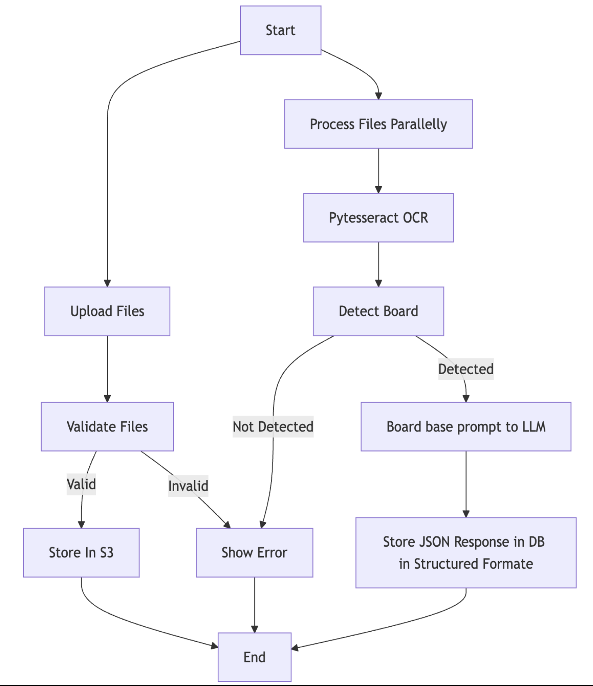

---

# ER Diagram

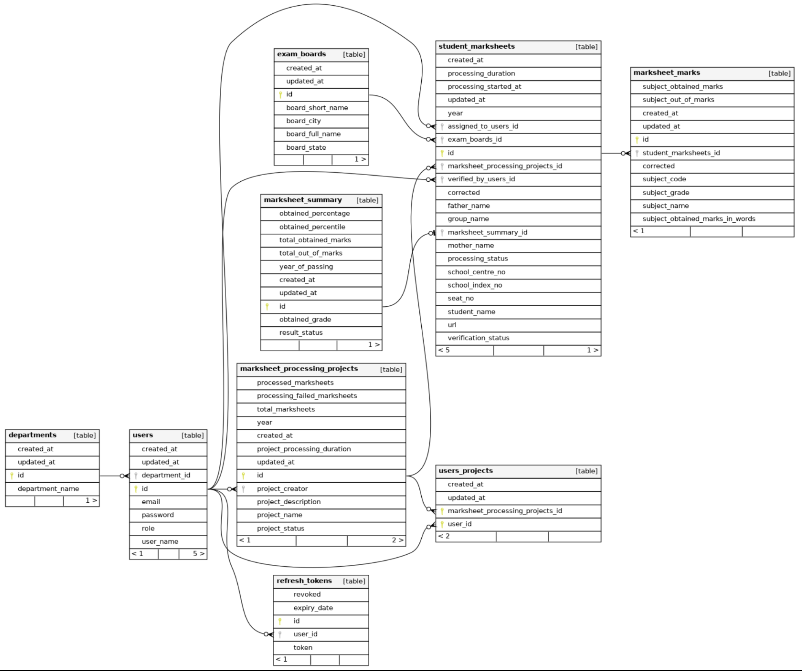

---

# User Manual

## Super Admin Dashboard

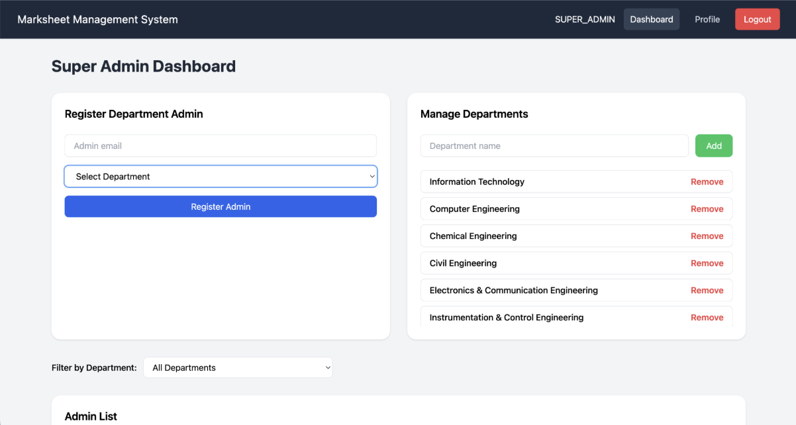

## Create Project Dashboard

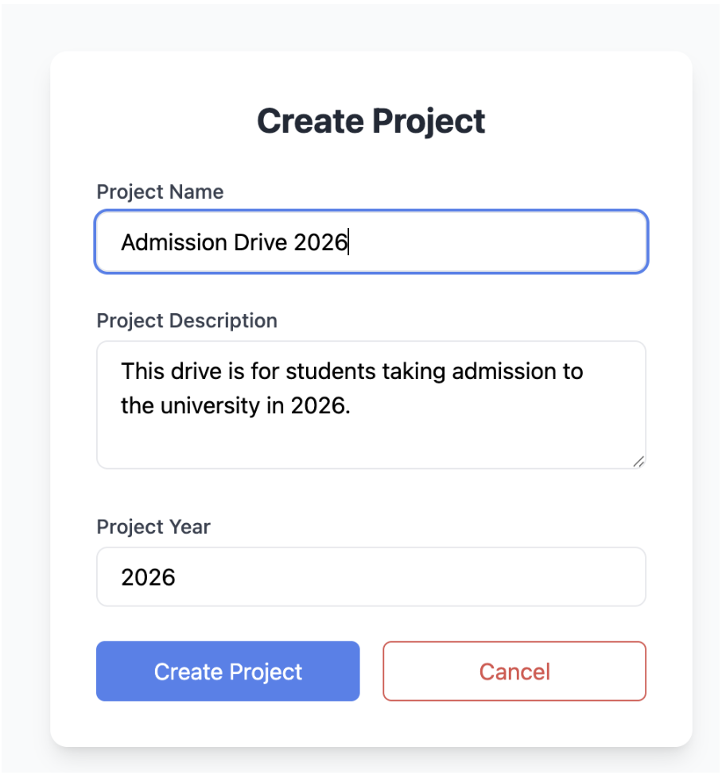

## Admin Project Dashboard

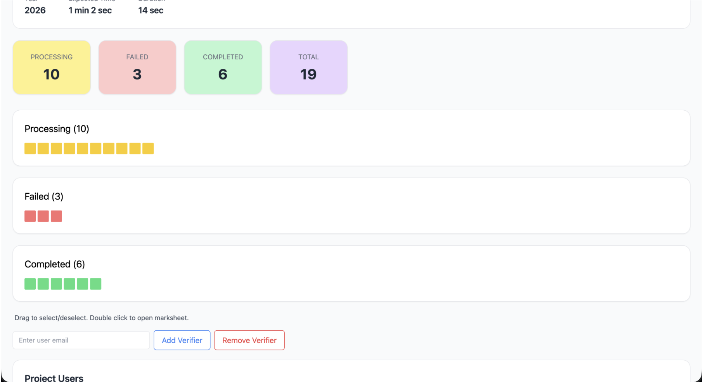

## Admin Add Verifier To Project

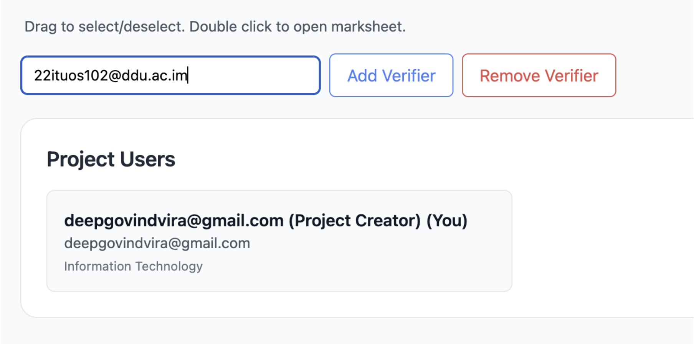

## Admin Assign Marksheets To Verifier

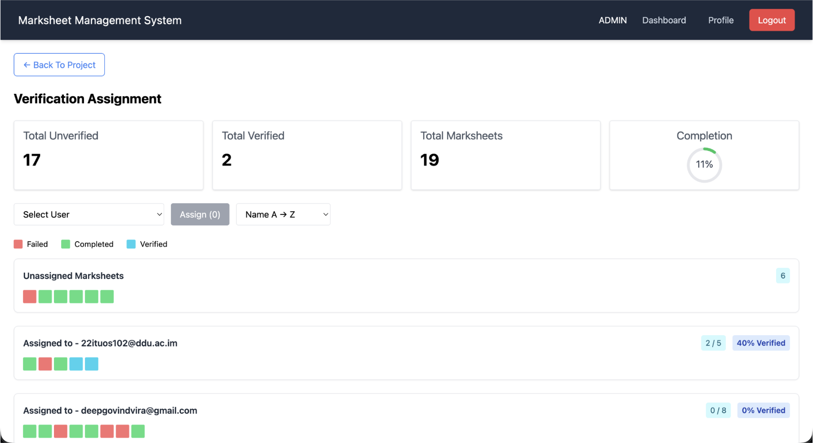

## Verifier Project Dashboard

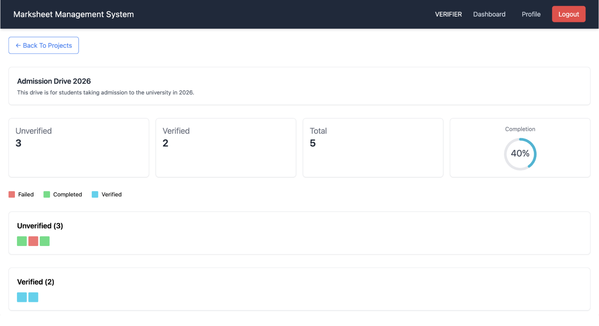

## Verifier Verifying Marksheet

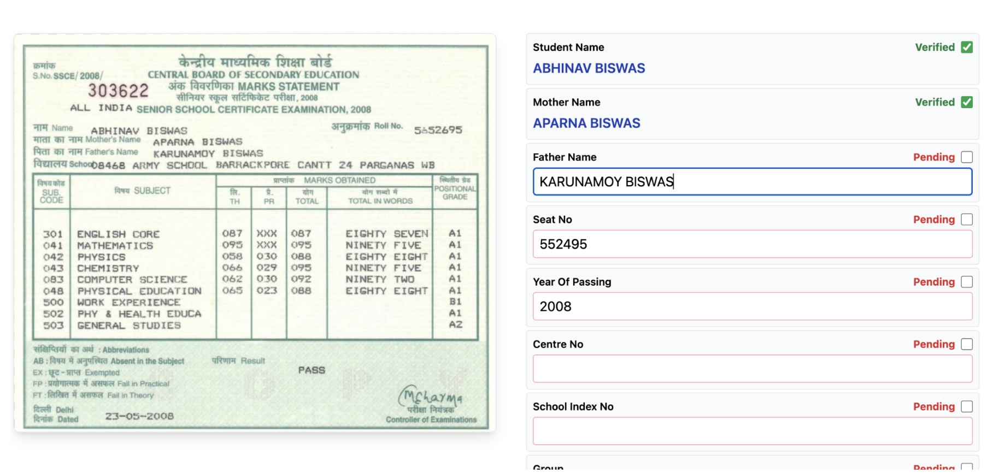

## View Marksheet

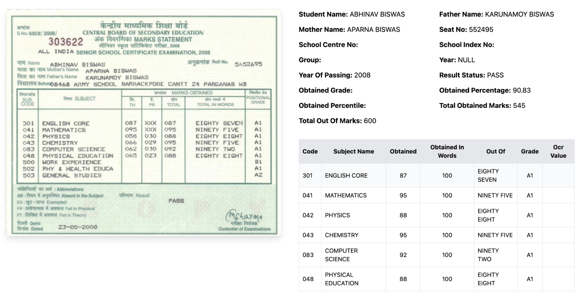

## Export Marksheet Data To Excel

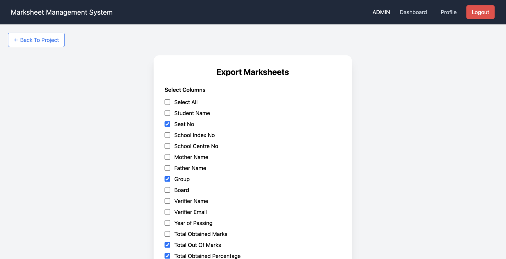

---

# Future Enhancements

* AI-based marksheet validation
* Support for additional education boards
* Cloud storage integration
* Analytics dashboard
* Bulk upload optimization
* Notification and email integration

---

# Conclusion

The Marksheet Management System streamlines the digitization and verification of academic marksheets through OCR automation and secure role-based workflows. Its scalable microservices architecture, concurrent processing capabilities, and real-time status tracking make it an efficient solution for educational institutions and organizations handling large volumes of student records.
